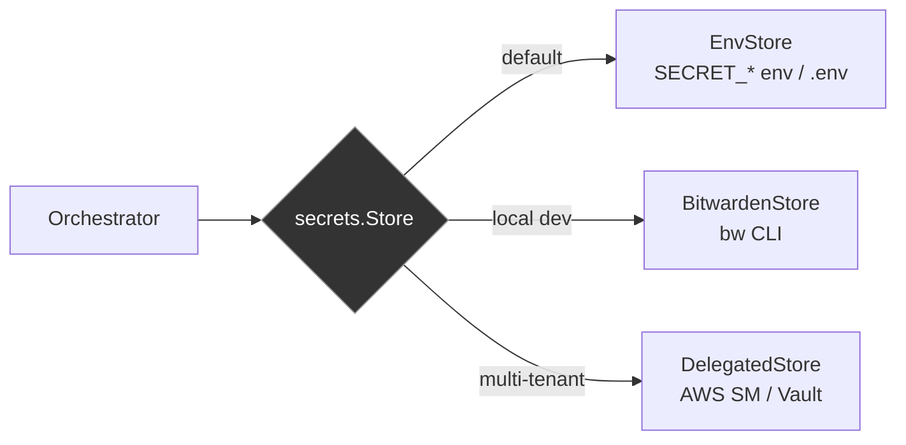
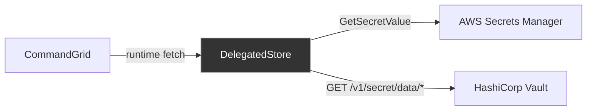

# Secret Store

The secret store is a pluggable system for credential management. Multiple backends implement the same `secrets.Store` interface, so the orchestrator doesn't care where secrets come from.

## Interface

```go
type Store interface {
    Get(name string) (string, error)
    Set(name, value string) error
    Delete(name string) error
    List() ([]string, error)
}
```

## Backends



### EnvStore

Source: `pkg/secrets/env.go`

Default backend. Reads secrets from environment variables or a `.env` file. Good for local dev and CI pipelines.

```bash
CommandGrid up   # env is default
# or explicitly:
CommandGrid up --secrets-provider env
```

Secret names are uppercased and prefixed. `Get("anthropic_key")` checks `SECRET_ANTHROPIC_KEY`. With a `.env` file, use the secret name as the key (e.g. `anthropic_key=sk-ant-...`).

```go
store, err := secrets.NewEnvStore("/path/to/.env", "SECRET_")
```

- Env vars take precedence over `.env` file values
- `Set` and `Delete` work in-memory only (not persisted)
- `.env` file loaded once at construction

### DelegatedStore

Source: `pkg/secrets/delegated.go`

For multi-tenant production. Fetches secrets from a customer's own external vault at runtime. CommandGrid never stores customer secrets.



Supported backends:

| Type | Auth | How it works |
|---|---|---|
| `aws_sm` | STS AssumeRole (cross-account) | HTTP API with SigV4 signing |
| `vault` | Token auth | KV v2 HTTP API |

```go
store, err := secrets.NewDelegatedStore(secrets.DelegatedConfig{
    Type:    "aws_sm",
    Region:  "us-east-1",
    RoleARN: "arn:aws:iam::role/customer-secrets",
})
```

Features:
- **Short-lived cache** (30s TTL) to avoid hammering external vaults
- **Read-only** -- `Set`, `Delete`, `List` return errors. Customers manage their own vaults.
- **Customer-scoped** -- each customer's profile can define a different `SecretsProviderConfig`

See [secrets-local-dev.md](secrets-local-dev.md) for a step-by-step guide on Bitwarden, env vars, and local development.

### BitwardenStore

Source: `pkg/secrets/bitwarden.go`

For developer machines that keep secrets in Bitwarden, CommandGrid can resolve
secrets with:

```bash
CommandGrid run --secrets-provider bitwarden
```

Notes:
- Read-only store (`Set`, `Delete`, `List` are unsupported)
- Requires `bw` CLI installed and authenticated/unlocked
- Uses `BW_SESSION` when present
- Resolves item values from `login.password` first, then `notes`

## How the orchestrator uses it

During `Up`, the orchestrator calls `store.Get(secretName)` for each secret in `sandbox.yaml`:

- **inject mode**: returned value is set as an env var in the sandbox
- **proxy mode**: returned value is sent to GhostProxy's session registry (never enters sandbox)

If any `Get` fails, the `up` command aborts before provisioning.

